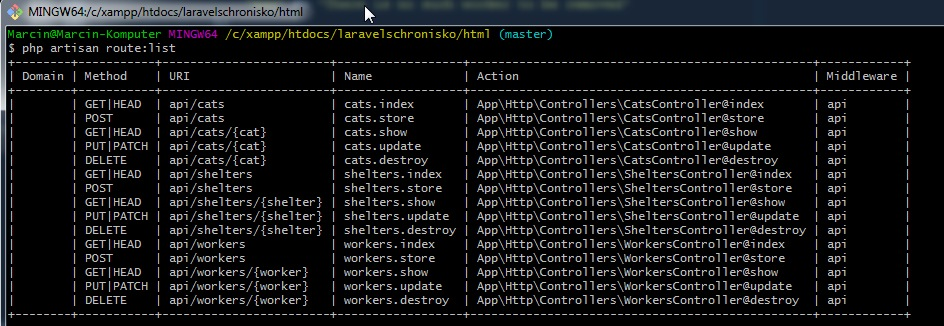

Laravel Shelter API Server
================

[](https://github.com/prusmarcin/laravelshelterapi/blob/master/LICENSE)


- [Installation](#installation)
- [Testing](#testing)
- [Documentation API](#documentation)
- [Credits](#credits)
- [License](#license)


Installation
------------

Clone repository to your catalog on server.

Then run `composer update` in your terminal to pull it in.

``` bash
$ composer update
```

And configure the database connection in `.env` file for your Laravel installation.

Run migration

``` bash
$ php artisan migrate
```
Note: If you have error when you run migration: "Specified key was too long error solution". Read this article: [https://geektnt.com/laravel-5-4-migration-unique-key-is-too-long.html](https://geektnt.com/laravel-5-4-migration-unique-key-is-too-long.html)

Run laravel server
``` bash
$ php artisan serve
```
And you're done!

Testing
-------

Then run the tests with:

``` bash
$ vendor/bin/phpunit
```

Documentation
-----

You need to run seeder then api will be return data.

``` bash
$ php artisan migrate:refresh --seed
```

All available methods by API:



Call method `GET`: `http://localhost:8000/api/shelters` for return all shelters.

Returns:

``` json
[
    {
        "name": "Schronisko Gdańsk",
        "city": "Gdańsk",
        "size": 1300
    },
    {
        "name": "Schronisko Gdynia",
        "city": "Gdynia",
        "size": 2200
    }
]
```

Call method `POST`: `http://localhost:8000/api/shelters` for create new shelter.

Must send body as JSON(application/json)
{
	"uskey":"a9d5m",
	"name":"Schronisko Testowe",
	"city":"Bydgoszcz",
	"size":100
}

Returns if is correct validation

``` json
{
    "uskey": "a9d5m",
    "name": "Schronisko Testowe",
    "city": "Bydgoszcz",
    "size": 100,
    "updated_at": "2018-04-21 18:56:35",
    "created_at": "2018-04-21 18:56:35",
    "id": 3
}
````

Returns if is incorrect validation

``` json
{
    "error": true,
    "msg": "The uskey must be at least 5 characters. "
}
````
OR
``` json
{
    "error": true,
    "msg": "The uskey has already been taken. "
}
````

Call method `GET`: `http://localhost:8000/api/shelters/1` for return selected shelter.

Returns:

``` json
{
    "name": "Schronisko Gdynia",
    "city": "Gdynia"
}
````

Call method `PUT` or `PATCH`: `http://localhost:8000/api/shelters/1` for update selected selter.

Must send body as JSON(application/json)
{
	"uskey":"a9d5m",
	"name":"Schronisko Testowe",
	"city":"Bydgoszcz",
	"size":100
}

Returns if is correct validation

``` json
{
    "msg": "Shelter updated.",
    "updated": true
}
````

Call method `DELETE`: `http://localhost:8000/api/shelters/1` for remove selected shelter.

Returns if shelter exists

``` json
{
    "msg": "The shelter was removed",
    "deleted": 1
}
```

Returns if shelter does not exist

``` json
{
    "error": true,
    "message": "There is no such shelter to be removed"
}
```

-------
Call method `GET`: `http://localhost:8000/api/workers` for return all workers.

Returns:

``` json
[
    {
        "id": 1,
        "name": "Michalina Baran",
        "age": 49,
        "shelter_id": 1,
        "created_at": "2017-10-03 11:29:50",
        "updated_at": null
    },
    {
        "id": 2,
        "name": "Mateusz Witkowski",
        "age": 48,
        "shelter_id": 1,
        "created_at": "2017-09-04 09:03:37",
        "updated_at": null
    },
    {
        "id": 3,
        "name": "Fryderyk Jaworski",
        "age": 46,
        "shelter_id": 1,
        "created_at": "2017-08-27 18:04:54",
        "updated_at": null
    }
]
```

Call method `POST`: `http://localhost:8000/api/workers` for create new worker.

Must send body as JSON(application/json)
{
	"name":"Jan Kowalski",
	"age":40,
	"size":100,
	"shelter_id":2
}

Returns if is correct validation

``` json
{
    "name": "Jan Kowalski",
    "age": 40,
    "shelter_id": 2,
    "updated_at": "2018-04-21 19:24:49",
    "created_at": "2018-04-21 19:24:49",
    "id": 14
}
````

Returns if is incorrect validation

``` json
{
    "error": true,
    "msg": "The selected shelter id is invalid. "
}
````

Call method `GET`: `http://localhost:8000/api/workers/1` for return selected worker.

Returns:

``` json
{
    "name": "Michalina Baran",
    "age": 49,
    "shelter_id": 1,
    "created_at": {
        "date": "2017-10-03 11:29:50.000000",
        "timezone_type": 3,
        "timezone": "UTC"
    },
    "updated_at": null
}
````

Call method `PUT` or `PATCH`: `http://localhost:8000/api/workers/1` for update selected worker.

Must send body as JSON(application/json)
{
	"name":"Jan Kowalski",
	"age":40,
	"size":"100",
	"shelter_id":2
}

Returns if is correct validation

``` json
{
    "msg": "Worker updated.",
    "updated": true
}
````

Call method `DELETE`: `http://localhost:8000/api/workers/1` for remove selected worker.

Returns if worker exists

``` json
{
    "msg": "The worker was removed",
    "deleted": 1
}
```

Returns if worker does not exist

``` json
{
    "error": true,
    "message": "There is no such worker to be removed"
}
```
-------
Call method `GET`: `http://localhost:8000/api/cats` for return all cats.

Returns:

``` json
[
    {
        "id": 1,
        "name": "Cezary",
        "color": "czarno-szary",
        "worker_id": 11,
        "shelter_id": 2,
        "created_at": "2018-04-07 16:05:11",
        "updated_at": null
    },
    {
        "id": 2,
        "name": "Julianna",
        "color": "brązowy",
        "worker_id": 5,
        "shelter_id": 1,
        "created_at": "2017-07-27 12:17:49",
        "updated_at": null
    }
]
```

Call method `POST`: `http://localhost:8000/api/cats` for create new cat.

Must send body as JSON(application/json)
{
	"name":"Burek",
	"color":"szary",
	"worker_id":9,
	"shelter_id":2
}

Returns if is correct validation

``` json
{
    "name": "Burek",
    "color": "szary",
    "worker_id": 9,
    "shelter_id": 2,
    "updated_at": "2018-04-21 19:31:45",
    "created_at": "2018-04-21 19:31:45",
    "id": 620
}
````

Returns if is incorrect validation

``` json
{
    "error": true,
    "msg": "The selected worker id is invalid. The selected shelter id is invalid. "
}
````

Call method `GET`: `http://localhost:8000/api/cats/1` for return selected cat.

Returns:

``` json
{
    "name": "Cezary",
    "color": "czarno-szary"
}
````

Call method `PUT` or `PATCH`: `http://localhost:8000/api/cats/1` for update selected cat.

Must send body as JSON(application/json)
{
	"name":"Burek",
	"color":"szary",
	"worker_id":8,
	"shelter_id":2
}

Returns if is correct validation

``` json
{
    "msg": "Cat updated.",
    "updated": true
}
````

Call method `DELETE`: `http://localhost:8000/api/cats/1` for remove selected cat.

Returns if cat exists

``` json
{
    "msg": "The cat was removed",
    "deleted": 1
}
```

Returns if cat does not exist

``` json
{
    "error": true,
    "message": "There is no such cat to be removed"
}
```

Credits
-------

- [Prus Marcin](https://github.com/prusmarcin)
- [My portfolio](https://prusmarcin.pl)


License
-------

The MIT License (MIT). Please see [License File](https://github.com/prusmarcin/laravelshelterapi/blob/master/LICENSE) for more information.
